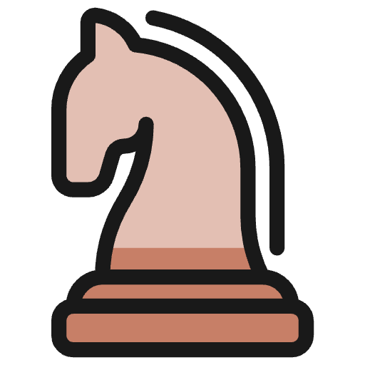

<!-- PROJECT LOGO -->
 

  

<h3 align="center">JavaChess</h3>

  

    JavaChess is a 2D Chess game built using Java.
  

<!-- ABOUT THE PROJECT -->

## About The Project

![JavaChess Screen Shot][JavaChess-screenshot]

Eat all of the dots while avoiding the four ghosts who pursue Pac-Man. When Pac-Man eats all of the dots, you advance to the next level. If Pac-Man is caught by a ghost, he loses a life; the game ends when all lives are lost. Each of the four ghosts has its own unique AI. The game increases in difficulty as the player progresses.

### Built With

![Java][Java]

<!-- USAGE EXAMPLES -->

## Usage

- Click and drag pieces to their desired squares

<!-- MARKDOWN LINKS & IMAGES -->
<!-- https://www.markdownguide.org/basic-syntax/#reference-style-links -->

[JavaChess-screenshot]: images/screenshot.png

<!-- Shields.io badges. You can a comprehensive list with many more badges at: https://github.com/inttter/md-badges -->

[Java]: https://img.shields.io/badge/Java-%23ED8B00.svg?style=for-the-badge&logo=openjdk&logoColor=white
